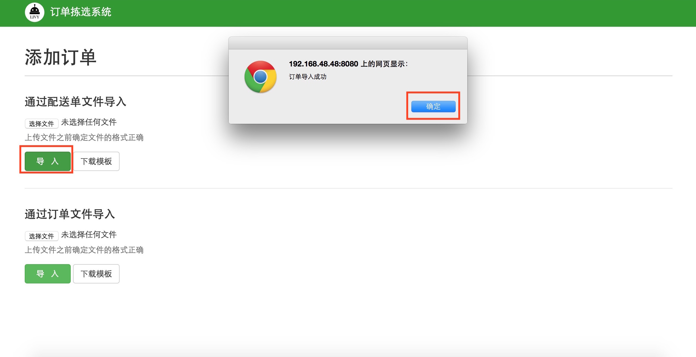

#2.1 订单管理
根据具体工作流程，最先使用订单拣选系统的订单管理，进入订单管理页面，如图2-2所示，需要导入该时间段所产生的配送单文件或者订单文件，配送单文件从公司ERP系统中获取。`首次导入订单前，点击下载模版，确保导入的配送单格式与模版中的格式一致`

`图2-2 导入配送单`

在图2-2系统界面单击添加，添加订单，选择文件打开，如图2-3所示

`图2-3 选择文件`

订单导入成功，如图2-4所示

`图2-4 导入订单`

##links
+ 上一节：[订单拣选系统操作说明](02.0.md)
+ 下一节：[集合单管理](02.2.md)
