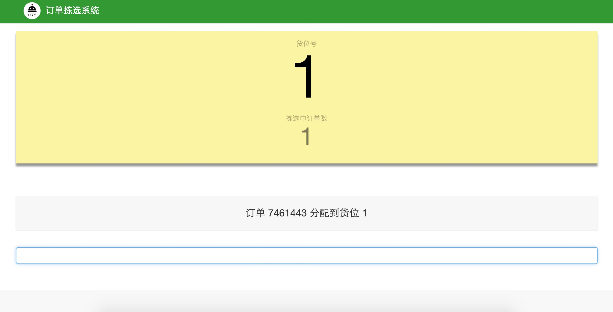
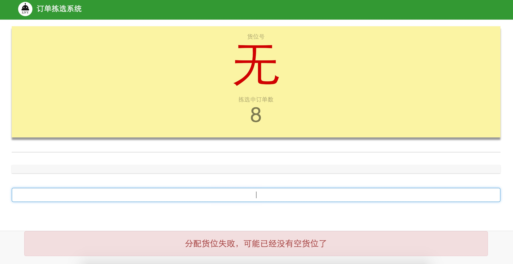
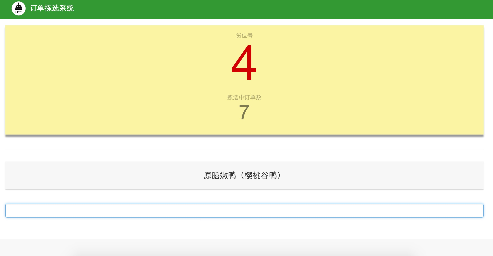
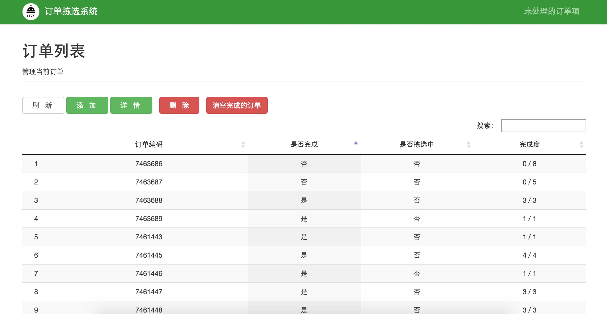
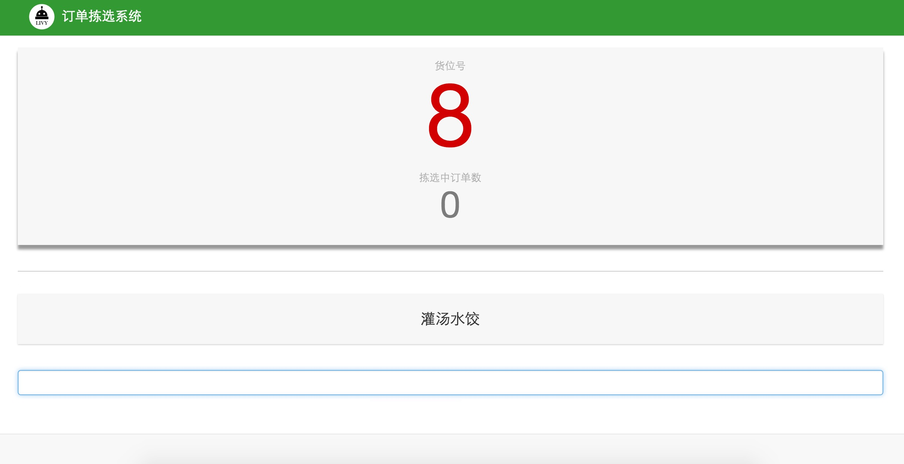
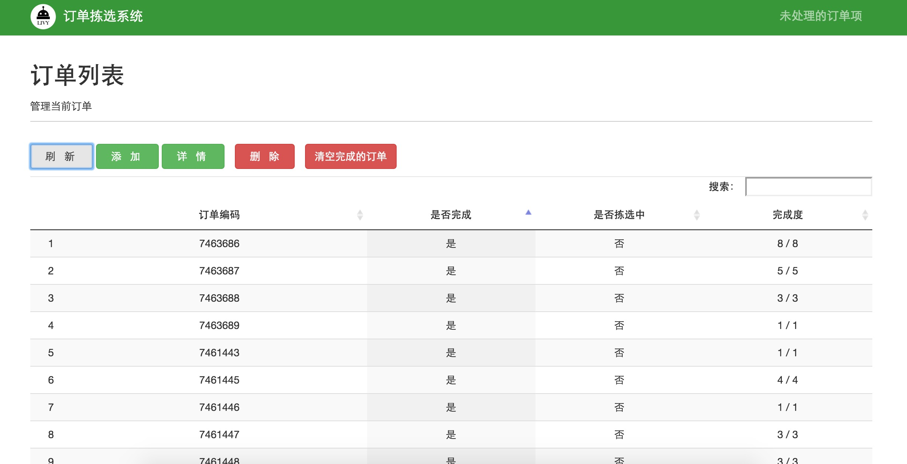

#2.4 订单拣选
从冻库拣选完商品，送到发货区进行二次拣选，打包发货。每个购物车上都有若干订单组成的一个集合单，给每个订单分配一个货位，扫描订单条码，系统自动分配货位，如图2-18所示，直到货位分配满为止。

`图2-18 分配货位`

货位全分配完后，系统会在页面提示`货位已满`，如图2-19所示

 
 `图2-19 货位已满` 

分配完货位，开始分拣商品到每个订单，使用条码枪扫描商品包装上的条码，系统会界面提示和语音提示该商品属于哪个货位，根据提示将商品放入指定货位，每个货位对应一个订单，某货位拣选完成，系统会提示，货位号的颜色变成红色，此订单完成，如图2-20所示。

如遇到购物车中的某商品不在此集合单商品列表中，系统会提示`当前订单中不需要该商品`，如图2-22所示

 
 `图2-22 当前订单中不需要该商品` 

在系统订单管理中，可以看到此集合单中所有订单的完成状态，如图2-23所示。

 
 `图2-23 查询订单完成状态` 

货位都拣选完成，系统界面上`拣选中的订单数会变成0`，如图2-24所示

 
 `图2-24 货位拣选完成` 

返回订单管理界面，刷新订单列表，会看到所有订单都为完成状态，如图2-25所示。此时，所有货位都为空，可以继续分配货位给下一个集合单进行下一次拣选。

 
 `图2-25 所有订单拣选完成` 

以上操作循环进行。

##links
+ 上一节：[产品管理](02.3.md)
+ 下一节:[仓库拣选模式](3.1.md)
