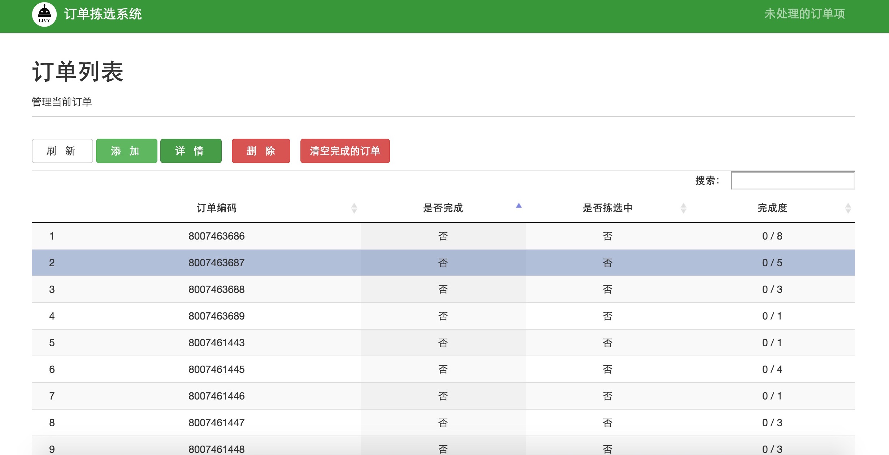
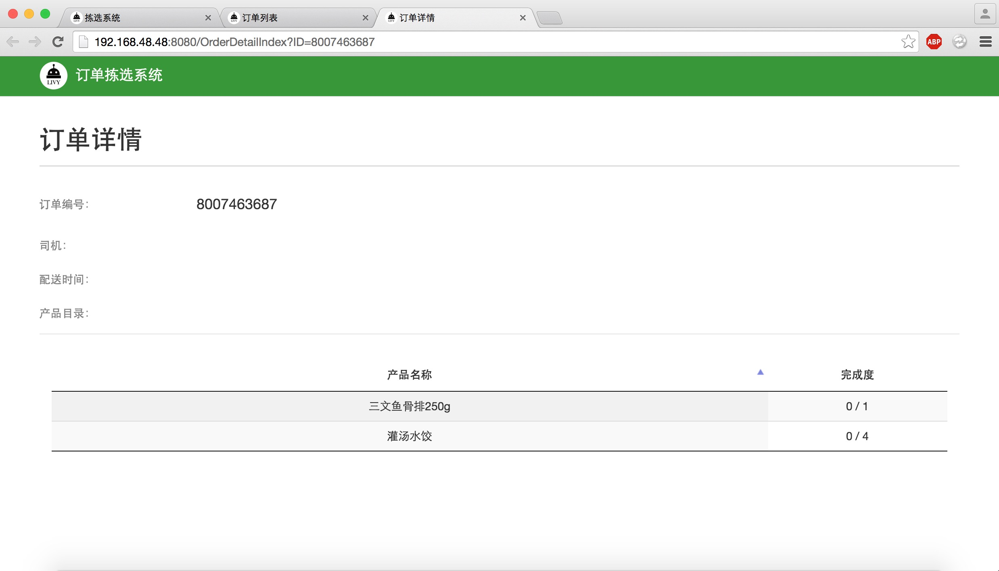
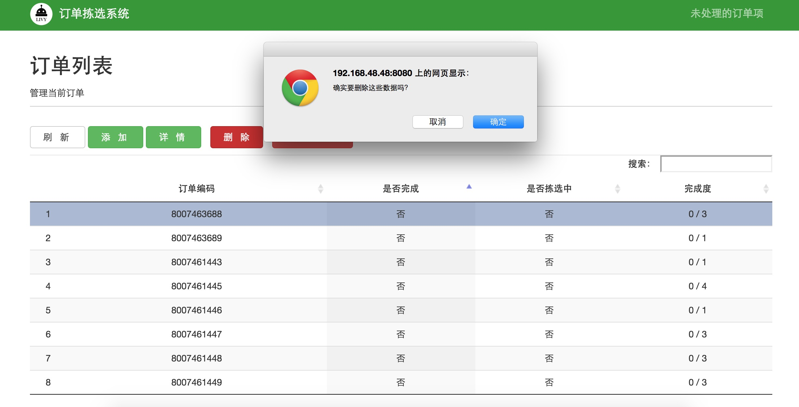
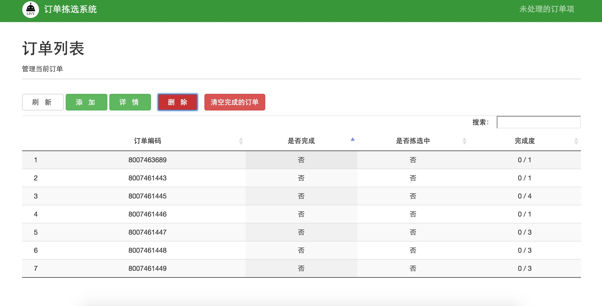

#3.1 订单管理
根据具体工作流程，最先使用订单拣选系统的订单管理，进入订单管理页面，如图3-2所示，需要导入该时间段所产生的配送单文件或者订单文件，配送单文件从公司ERP系统中获取。`首次导入订单前，点击下载模版，确保导入的配送单格式与模版中的格式一致`

 
 `图3-2 导入配送单` 

确认配送单或订单无误，在图3-2系统界面单击添加，添加订单，选择文件打开，如图2-3所示

 
 `图3-3 选择文件` 

订单导入成功，如图3-4所示

 
 `图3-4 导入订单` 

点击订单拣选图标，回到系统首页，如图3-1所示，点击订单管理，进入订单列表页面点击刷新，系统页面列出需要拣选的订单列表，如图2-5所示

 
 `图3-5 订单列表详情` 

如需查看某订单中需要商品的详情，单击此条订单，点击详情，如图3-6所示，在此页面中能看到产品名称，数量与完成进度。

 
 `图3-6 订单详情` 

回到订单列表页面，如果导入的配送单中的某条订单有误需要删除，选中此订单，单击删除，如图3-7所示

 
 `图3-7 删除多余订单` 

删除某订单后的订单列表如图3-8所示

 
 `图3-8 删除订单后的订单列表` 

##links
+ 上一节：[订单拣选系统操作说明](03.0.md)
+ 下一节：[集合单管理](03.2.md)
