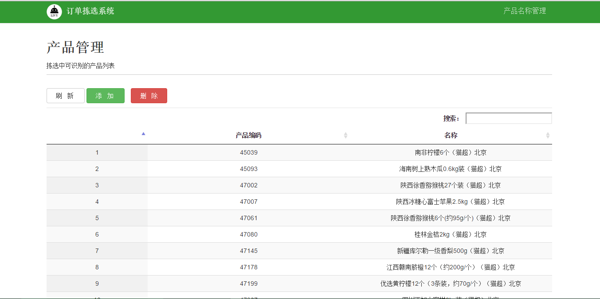

###1.2订单拣选系统功能构成：
####订单拣选系统具体包括产品管理、订单管理、集合单管理、订单拣选4大功能模块。对配送作业中冻库拣货、订单拣选等环节进行优化。
###1.2.1 产品管理
####单击“产品管理”标签，进入产品管理模块主界面。此模块主要包括产品信息查看、产品信息删除、产品名称管理 3个功能。
- 产品信息浏览。导入配送单（订单）配送后，系统会在“产品管理”界面自动生成本批次所需产品信息列表。 
- 产品信息的删除。通过“删除”标签可以删除产品列表已存在产品信息。
- 产品名称管理。该模块进行新产品信息的查看、删除。订单拣选系统以产品的名称作为产品识别的唯一ID，新产品必须通过“产品名称管理品”进行管理。通过“对应条码数量”可以清楚地识别新添加的产品（0表示新产品，未添加条码信息，1表示已有产品，条码信息已添加）。利用手持终端通过扫码的形式进行新产品条码信息的录入，形成相应完整的产品信息表。

 
 `图 1-2订单拣选系统--产品管理操作界面`

 
###1.2.2订单管理
####单击“订单管理”标签，进入订单管理模块的主界面。该模块可以实现订单添加、订单删除、订单详情查看、清空已完成订单、查看未处理订单项5个功能。
- 查看未处理订单项。未处理订单项即为系统中新出现的的产品。 配送单（订单）导入后，存在新产品，系统会自动跳转到“未处理订单项”界面。业务员选择将该产品加入本库或者过滤掉（非冻库产品）。
- 订单添加。根据实际数据获取的情况可以选择通过订单或者配送单进行信息导入，系统会形成冷冻产品相应班次的订单列表。
- 订单删除。选中某个订单，点击“删除”标签即可。
- 订单详情查看。选中某个订单，点击“详情”，可查看订单的具体内容。
- 清空已完成订单。点击“清空完成订单”，系统会自动对“已完成”的订单进行删除。产品信息列表中未完成的订单不会受影响

 
`图 1-3订单拣选系统--产品管理操作界面`

###1.2.3集合单管理

####点击“集合单管理”标签，进入集合单管理的主界面。该模块可以实现集合单的创建、查找、拣选、删除4个功能。在冻库中进行相应集合单的拣选。此模块可以有效地提高冻库一次拣选的效率，也是实现一次拣选与二次拣选的交接的关键点。
- 集合单合成。订单导入后，点击“新集合单”标签实现订单集合。可以根据实际情况（拣选车的容量、货位的多少）选取每n个订单合并为一个集合单，形成相应的m个集合单。
- 集合单查找。光标定位在文本输入框，扫任意订单条码信息，订单所在的集合单行会变成”绿色“。保证所拣产品跟集合单相匹配对应。
- 集合单拣选。选中“绿色”集合单，通过单击“开始拣选”标签，开始进行冻库中所需产品的拣选。所有集合单拣选完成后，通过“刷新”标签可检验集合单状态：显示浅灰色即表示集合单拣选完成。
- 集合单删除。通过“删除”标签可以将错加的集合单删除。通过“新集合单”标签重新添加正确集合单。

 
`图 1-4订单拣选系统--产品管理操作界面`

###1.2.4订单拣选
####点击“订单拣选”标签，进入订单拣选的主界面。该模块可以实现订单货位的分配和订单产品的拣选、查看在拣的订单数、货位的即时添加4个功能。
- 订单货位分配。对已经拣选出库的一联集合拆分成独立订单，按照”一单一货位“的原则，通过订单的扫码进行订单货位的分配。
- 产品的订单分配。扫产品相应的条码信息，根据语音提示选择相应的货位。 
- 在拣订单的查看。如果商品拣选完成后，页面提示“拣选中的订单”不为“0”，点击订单数查看货位拣选详细信息，通过“强制清空货位”、“强制完成拣选中的订单”，进行订单的强制完成和货位的强制清空。
- 货位的即时添加。即订单的货位分配和产品的分配可同时进行。

 
`图 1-5订单拣选系统--产品管理操作界面`

##links
- 上一节：[系统说明](1.1.md)
+ 下一节：[订单拣选系统业务流程](1.3.md)

