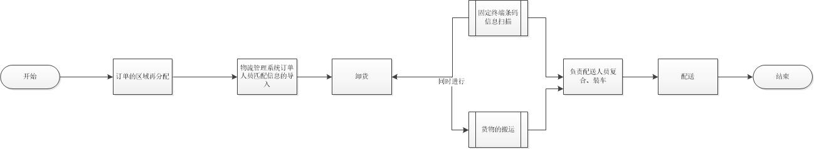

##6、解决方案：
###现状：
####团结湖站效率问题主要集中在区域订单产品的查找上。作业场地较小，8个配送人员根据拣货经验查找属于自己细分区域订单里的商品。排除天气影响因素，分拣150单信息，8人同时作业耗时1小时左右，秩序比较混乱，效率低。若产生某个配送员多拣、错拣的情况，其余人员需等到拣选完成后进行查找核对，是的配送时间延迟，严重影响配送效率。
###问题：
####效率低，主要集中于在区域订单产品的查找上
###解决方案：
####构件一个货物快速拣选辅助系统，利用终端扫描和信息提示，实现货物人员的快速匹配，解决人工按单找货效率低、易出错的问题。
###系统构成关键点：
####匹配信息导入 、人员分工、 终端扫描  、 信息提示
###系统业务流程优化：
 
- 信息的导入：将ERP系统中的订单信息与配送员--订单匹配信息进行导入，系统会自动生成订单配送信息，包括订单配送信息、订单详情、该订单的配送员。
- 终端扫描与信息提示。使用固定条码扫描器，货物在卸车时进行扫描，按人分货。即卸货与货物扫描同时进行，2-3个配送员在配送车上作业，6-5个配送员在线面进行货物的搬运。货物在固定条码扫描终端经过时，系统读取到信息，会在显示器上显示该订单的配送信息、配送人员。搬运人员按照提示进行货物搬运到相应的存放区域。
- 人员分工：根据实际单量和操作人员进行人员按分工。分别负责货物的扫描、货物的搬运。

####系统作业流程图：

