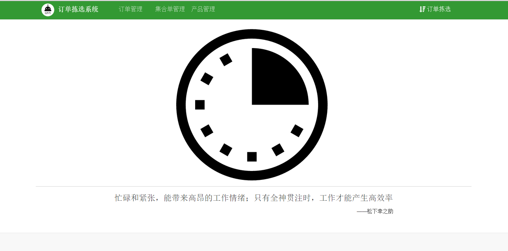

#
第二章 订单拣选系统介绍

###2.1订单拣选系统说明
订单拣选系统以实现订单高效拣选为目的设计的一款系统软件，系统界面设计清晰，便于作业人员的操作。操作流程涉及产品冻库一次冻选和自由作业区二次拣选，较人工拣选，简单快速、正确率高。

订单拣选系统的功能实现以订单所需产品的提前贴标为前提，即交接环节所贴产品贴标要在产品冻库拣选前实现。

`图 2-1订单拣选系统主界面`

##link
+ 上一节：[易果冻库拣选的现状分析](1.0.md)
+ 下一节：[订单拣选系统系功能构成](2.2.md)