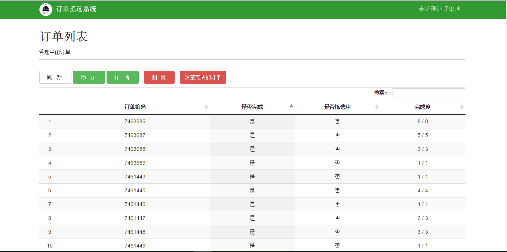

###2.3 订单管理
####单击“订单管理”标签，进入订单管理模块的主界面。该模块可以实现订单添加、订单删除、订单详情查看、清空已完成订单、查看未处理订单项5个功能。
- 查看未处理订单项。未处理订单项即为系统中新出现的的产品。 配送单（订单）导入后，存在新产品，系统会自动跳转到“未处理订单项”界面。业务员选择将该产品加入本库或者过滤掉（非冻库产品）。
- 订单添加。根据实际数据获取的情况可以选择通过订单或者配送单进行信息导入，系统会形成冷冻产品相应班次的订单列表。
- 订单删除。选中某个订单，点击“删除”标签即可。
- 订单详情查看。选中某个订单，点击“详情”，可查看订单的具体内容。
- 清空已完成订单。点击“清空完成订单”，系统会自动对“已完成”的订单进行删除。产品信息列表中未完成的订单不会受影响

 
`图 2-3订单拣选系统--产品管理操作界面`

 ##link
+ 上一节：[产品管理](2.2.md)
+ 下一节：[集合单管理](2.4.md)