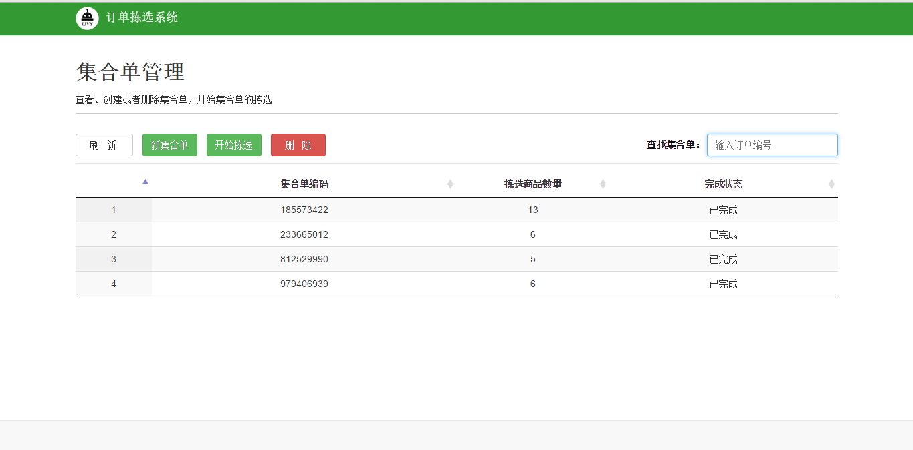

###2.4 集合单管理

####点击“集合单管理”标签，进入集合单管理的主界面。该模块可以实现集合单的创建、查找、拣选、删除4个功能。在冻库中进行相应集合单的拣选。此模块可以有效地提高冻库一次拣选的效率，也是实现一次拣选与二次拣选的交接的关键点。
- 集合单合成。订单导入后，点击“新集合单”标签实现订单集合。可以根据实际情况（拣选车的容量、货位的多少）选取每n个订单合并为一个集合单，形成相应的m个集合单。
- 集合单查找。光标定位在文本输入框，扫任意订单条码信息，订单所在的集合单行会变成”绿色“。保证所拣产品跟集合单相匹配对应。
- 集合单拣选。选中“绿色”集合单，通过单击“开始拣选”标签，开始进行冻库中所需产品的拣选。所有集合单拣选完成后，通过“刷新”标签可检验集合单状态：显示浅灰色即表示集合单拣选完成。
- 集合单删除。通过“删除”标签可以将错加的集合单删除。通过“新集合单”标签重新添加正确集合单。

 
`图 2-4订单拣选系统--产品管理操作界面`

 ##link
+ 上一节：[订单管理](2.3.md)
+ 下一节：[订单拣选](2.5.md)