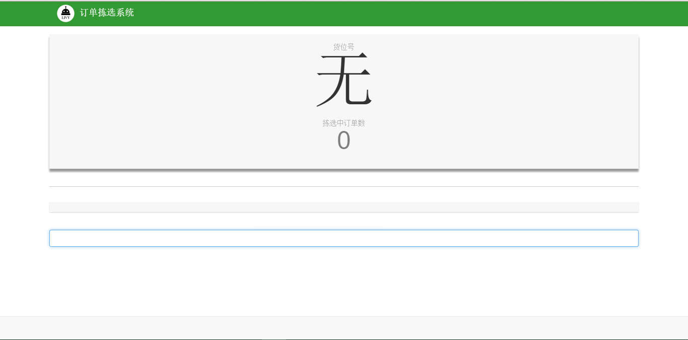

##2.5 订单拣选
点击“订单拣选”标签，进入订单拣选的主界面。该模块可以实现订单货位的分配和订单产品的拣选、查看在拣的订单数、货位的即时添加4个功能。
- 订单货位分配。对已经拣选出库的一联集合拆分成独立订单，按照”一单一货位“的原则，通过订单的扫码进行订单货位的分配。
- 产品的订单分配。扫产品相应的条码信息，根据语音提示选择相应的货位。 
- 在拣订单的查看。如果商品拣选完成后，页面提示“拣选中的订单”不为“0”，点击订单数查看货位拣选详细信息，通过“强制清空货位”、“强制完成拣选中的订单”，进行订单的强制完成和货位的强制清空。
- 货位的即时添加。即订单的货位分配和产品的分配可同时进行。

 
`图 2-5订单拣选系统--产品管理操作界面`

  ##links
+ 上一节：[集合单管理](2.4.md)
+ 下一节：[订单拣选系统业务流程](2.6.md)