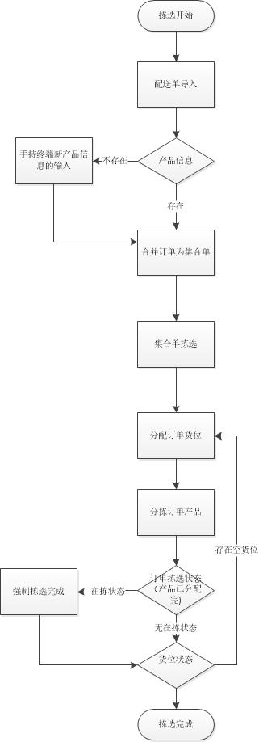

##2.6 订单拣选系统业务流程：
 

前提：冻库拣选前，产品内部条码已贴。
订单拣选系统的操作流程一般包括以下几个步骤：
- 订单导入
- 商品信息的添加
- 订单的合并
- 集合单的拣选（冻库一次拣选）
- 订单货位的分配（二次拣选）
- 订单产品的拣选（二次拣选）

系统操作流程图如下：

##links
- 上一节：[订单拣选](2.5.md)
+ 下一节 : [简介](3.1.md)
