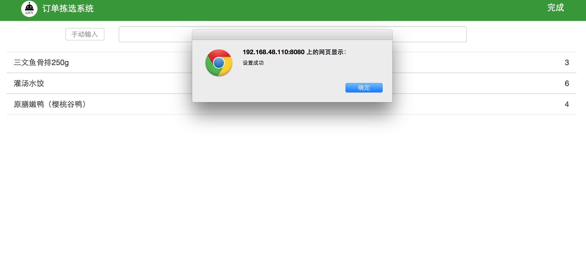
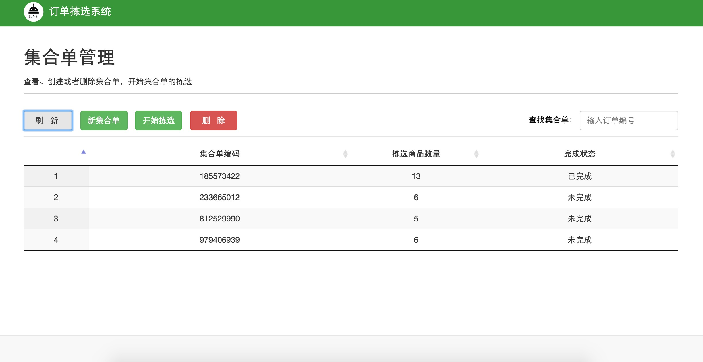
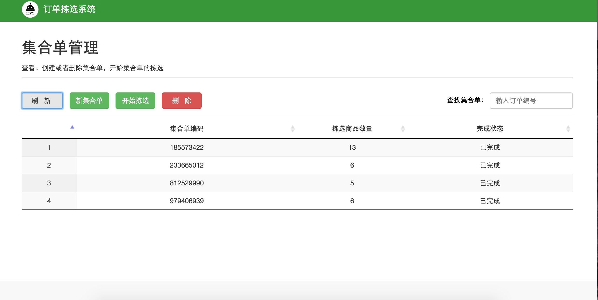

##3.10 集合单拣选
产品拣选：根据以上生成集合单，开始在冻库拣选商品，在集合单管理首页，鼠标点击查找集合单的输入框，用条码枪扫描订单，此时会在集合单管理页面显示此订单所在的集合单，如图3-15所示

 
 `图3-15 查找集合单` 

鼠标点击此集合单，然后点击此页面的开始拣选按钮，就会在系统页面中出现此集合单中所有商品信息与数量，如图3-16所示，根据页面显示，拣选商品。

 
 `图3-16 集合单详情` 

此集合单拣选完成后，点击页面右上角完成按钮，如图3-17所示

 
 `图3-17 集合单拣选完成` 

返回集合单管理首页，点击刷新按钮，可以查看拣选完成状态，如图3-18所示，已拣选完成的集合单显示为`已完成`，反之，则是`未完成`。

 
 `图3-18 查看未完成集合单` 

点击开始拣选，继续拣选未完成的集合单，等所有集合单都完成后，返回集合单管理首页，点击刷新，如图3-19所示。

 
 `图3-19 订单集合完成` 

 ##links
 + 上一节：[ 删除集合单](3.8.md)
 + 下一节：[集合单拣选](3.10.md)

