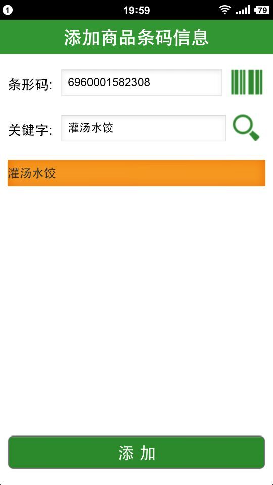

##3.11 产品信息录入
新增产品的信息添加、删除：
如图3-20，在订单拣选系统中，点击“产品管理”标签进入产品管理模块界面，在订单拣选开始阶段，操作人员若发现有新增产品或者产品信息有变动的产品，利用手持终端通过扫码的形式依次进行产品信息录入。

 
 `图3-20新产品信息录入操作界面` 

如图3-21、图3-22和图3-23，在手持终端操作界面中，点击“扫描”按钮，开始扫描商品的条码信息，识别的条形码会自动显示在条形码栏。在关键字栏属于要添加商品的关键字，点击“搜索”按钮，界面上会根据关键字在产品信息库里拣选出于关键字相匹配的商品列表，操作员根据实际要添加商品信息匹配正确信息。刷新列表形成新的产品信息表，新增产品信息的添加、删除可以通过“产品名称管理”功能实现。

 
 `图3-21 手持终端添加商品条码信息操作界面` 

 
 `图3-22 手持终端选择应添加的商品信息` 

 
 
 `图3-22 添加商品信息成功` 

##links
+ 上一节：[集合单管理](03.2.md)
+ 下一节：[订单拣选](03.4.md)