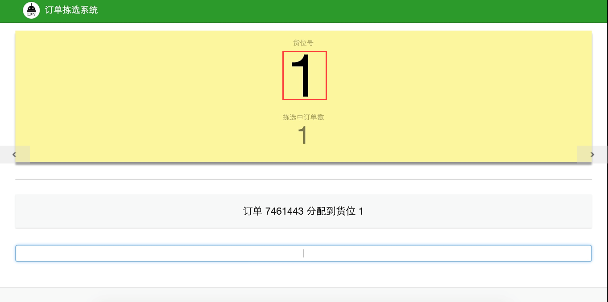
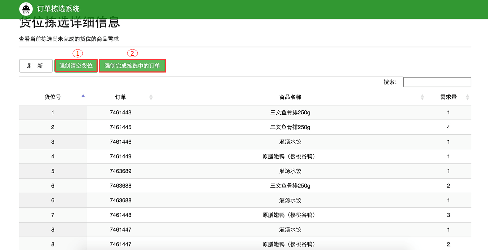

##3.14货位拣选详细信息
选定拣选墙之后，开始对订单进行拣选。根据拣选墙货位数量，用条码枪扫描相应数量的订单号，系统将自动分配对应货位，并在系统中以较大的粗黑字体显示出来，如图3-26中的红色框中的数字：

 
 `图3-26 订单拣选系统--货位分配`

若要查询当前拣选中的订单的详细信息可点击图3-26中红框下面的小灰色数字，进入“货位拣选详细信息”页面。如图3-27所示：

 
 `图3-27 订单拣选系统--货位拣选详细信息-`

当订单中出现非冻库产品时，将导致该订单所在货位无法自动空出，使得该货位一直处于占用状态，无法进一步分配其他订单到此货位。此时，若发现该订单冻库产品已拣选完成，可选中该订单货位所在行，之后点击图中红色方框中的“强制清空货位”，系统会自动释放该货位。
