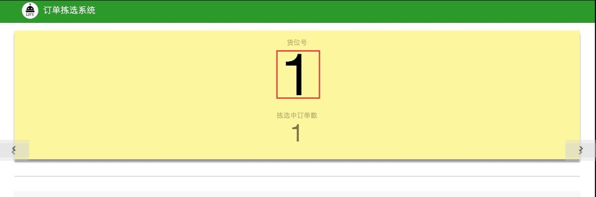
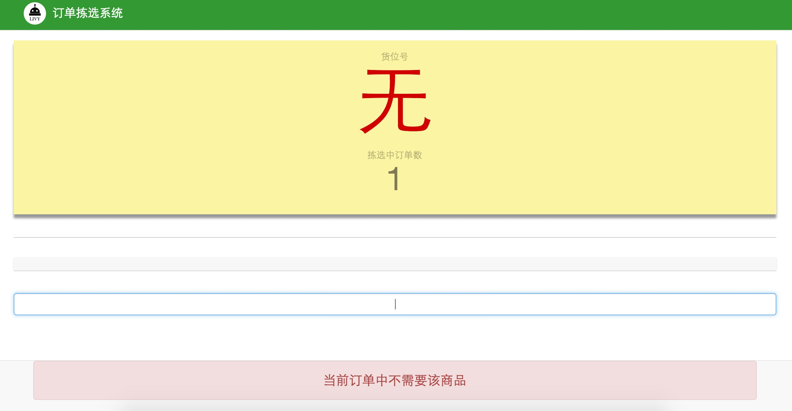
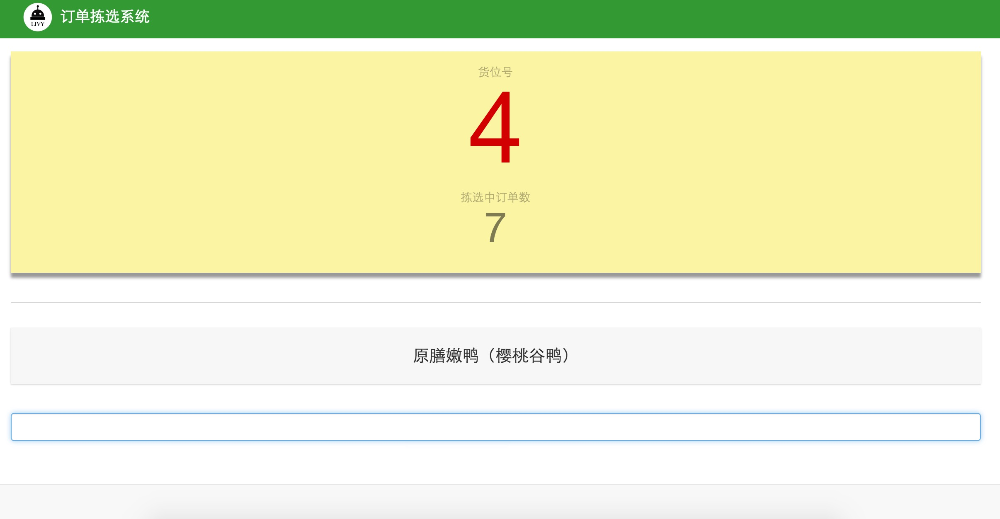

##3.15 订单拣选
当对应拣选墙的货位全部分配出去之后，将对已分配订单进行拣选。拣选过程为直接用条码枪扫描产品条码，若该产品属于当前货位上某一个订单，系统会提示其应当归属的货位号，如图3-28中的红色方框所示：

 
 `图3-28 订单拣选系统--订单拣选`

若某一产品不属于当前货位上的任何订单，系统会提上“当前订单中不需要该商品”，并同时在货位号处显示大红色的“无”字，如图3-29所示：

 
 `图3-29 订单拣选系统--当前订单不需要该产品`

当某一货位订单中的所有产品均已拣选完成，在扫描其最后一个产品时，系统会以大红色的数字来凸显出其货位号，如图3-30所示的4号货位，此时即说明该货位已拣选完成。

 
 `图3-30 订单拣选系统--单个订单拣选完成`
