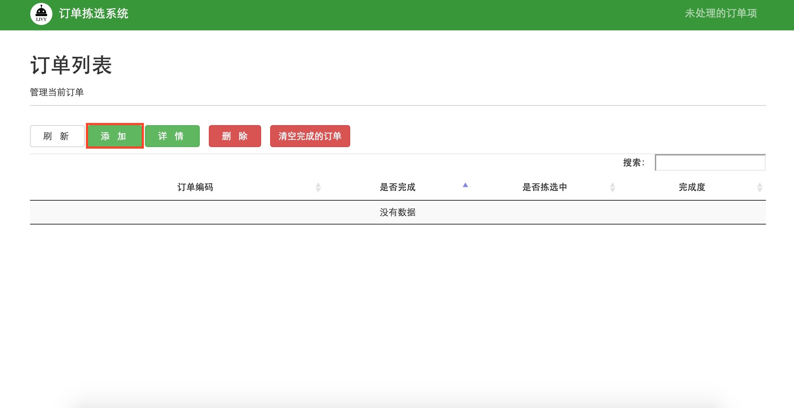
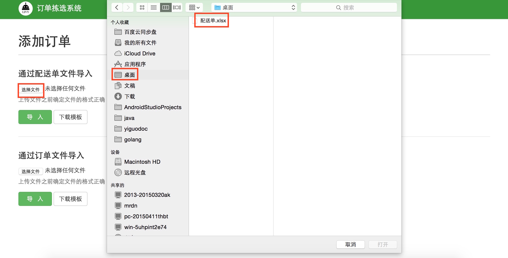
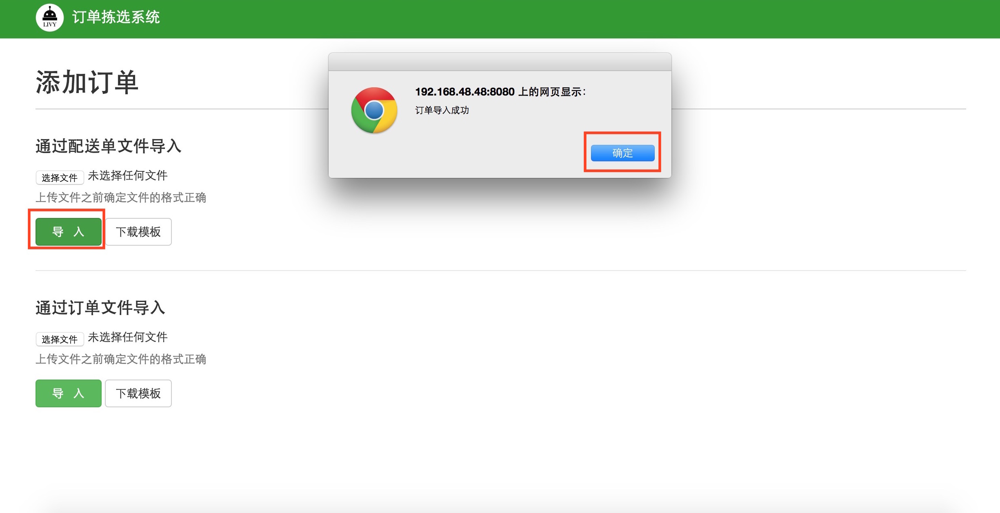
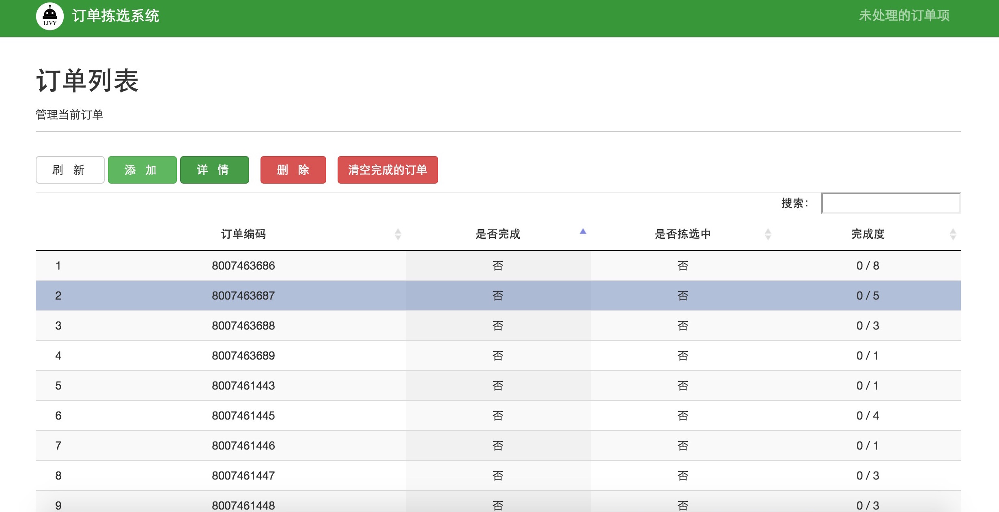

##3.2 添加订单
根据具体工作流程，最先添加配送单或者订单，点击订单拣选系统的“订单管理”，进入订单管理页面，如图3-2所示，导入该时间段所产生的配送单文件或者订单文件（配送单文件从公司ERP系统中获取）。`首次导入订单前，点击下载模版，确保导入的配送单格式与模版中的格式一致`

 
 `图3-2 导入配送单` 

 
 确认配送单或订单无误，在图3-2系统界面单击添加，添加订单，选择文件打开，如图3-3所示
 
 
 
 `图3-3 选择文件` 

 
 订单导入成功，如图3-4所示
 
 
 
 `图3-4 导入订单` 

 
 订单列表浏览：点击订单拣选系统图标，回到系统首页，如图3-1所示，点击订单管理，进入订单列表页面点击刷新，系统页面列出需要拣选的订单列表，如图2-5所示

 
 `图3-5 订单列表详情` 

 
##links
+ 上一节：[简介](3.1.md)
+ 下一节：[未处理的订单](3.3.md)