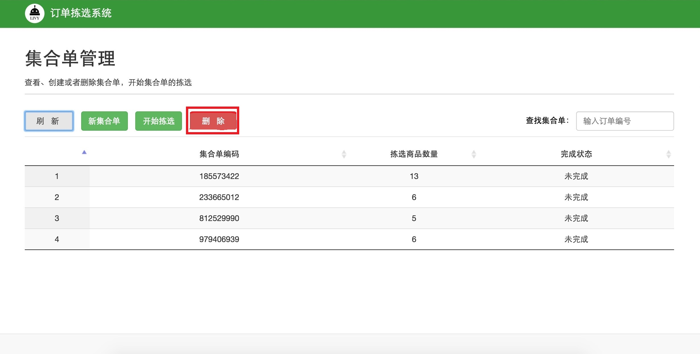
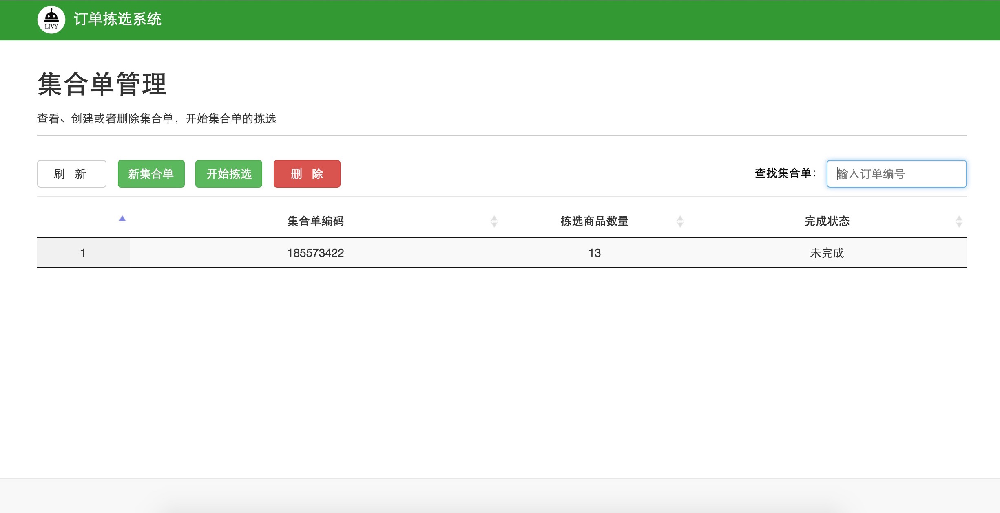
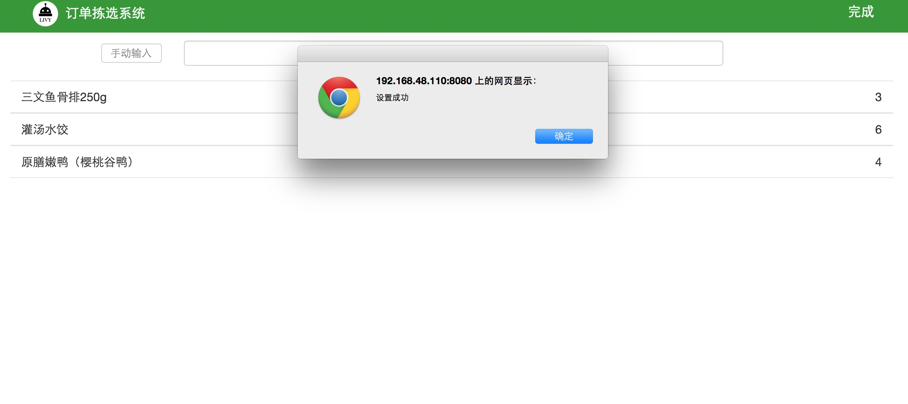

#3.2 集合单管理
集合单合并数量原则：订单导入成功后，由于去冻库拣货使用购物车为容器和运输工具，购物车容量有限，为了提高购物车的装载率，需要合并若干订单来确保每次都能装满购物车。

集合单合并：在系统首页点击集合单管理按钮，如图3-9所示，`合并订单数量的原则是几个订单中商品能够装满整个购物车`。

 
 `图3-9 集合单管理模块` 

点击系统页面新集合单按钮，如图3-10所示，使用条码枪扫描订单条码，鼠标点击输入框，扫描条码，如图2-10所示。

 
 `图3-10 扫描订单集合` 

扫描订单，若干个合并成一个集合单，系统界面会出现集合单中订单数和集合单总商品量，如图3-11所示

 
 `图3-11 生成集合单` 

订单不存在：如果扫描的订单不在导入的订单中，则会在系统页面下边显示“该订单不存在”，如图3-12所示

 
 `图3-12 扫描订单不存在` 

订单重复扫描：如果重复扫描同一个订单，则会在系统页面下边显示“订单XXX已经被合并过”，如图3-13所示

 
 `图3-13 重复扫描同一个订单` 

新集合单创建完成后，返回集合单管理首页，单击刷新按钮，就会出现合并成功的集合单，如图3-14所示，如集合单合并有误或需要修改集合单，单击某个集合单，单击删除按钮，删除此集合单。

 
 `图3-14 集合单管理模块` 

产品拣选：根据以上生成集合单，开始在冻库拣选商品，在集合单管理首页，鼠标点击查找集合单的输入框，用条码枪扫描订单，此时会在集合单管理页面显示此订单所在的集合单，如图3-15所示

 
 `图3-15 查找集合单` 

鼠标点击此集合单，然后点击此页面的开始拣选按钮，就会在系统页面中出现此集合单中所有商品信息与数量，如图3-16所示，根据页面显示，拣选商品。

 
 `图3-16 集合单详情` 

此集合单拣选完成后，点击页面右上角完成按钮，如图3-17所示

 
 `图3-17 集合单拣选完成` 

返回集合单管理首页，点击刷新按钮，可以查看拣选完成状态，如图3-18所示，已拣选完成的集合单显示为`已完成`，反之，则是`未完成`。

 
 `图3-18 查看未完成集合单` 

点击开始拣选，继续拣选未完成的集合单，等所有集合单都完成后，返回集合单管理首页，点击刷新，如图3-19所示。

 
 `图3-19 订单集合完成` 

##links
+ 上一节：[订单管理](master/03.1.md)
+ 下一节：[产品管理](03.3.md)