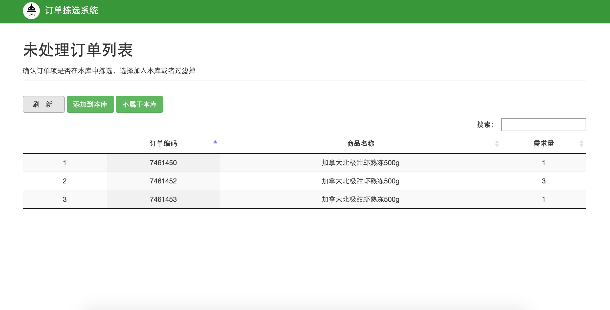
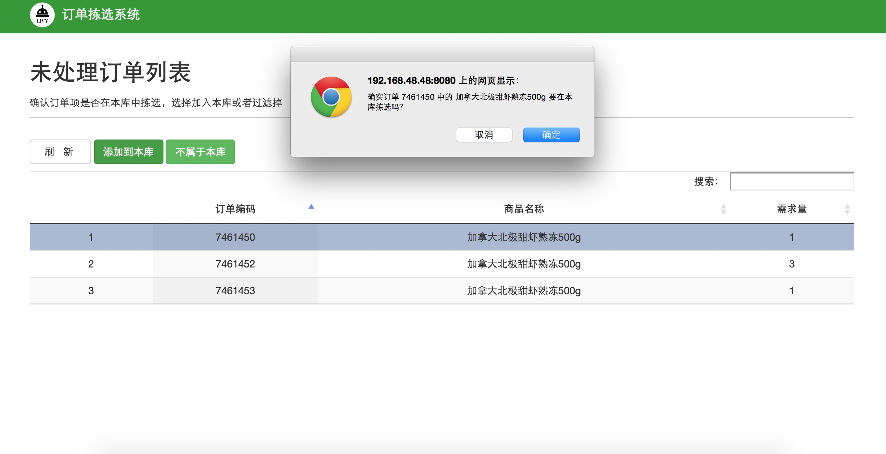

##3.3 未处理订单
导入配送单或订单之后，如果订单中出现的商品未曾收录在原有数据库中，或者此商品不在现有仓库拣选，系统会自动跳转到`未处理订单列表`页面，如图所示

 
 `未处理订单列表` 

若未处理订单列表中的商品属于本仓库，则选中订单，再点击添加到本库按钮，确定。如图所示

 
 `未处理订单商品添加到本库` 

 
 若未处理订单列表中的商品不属于本仓库，不在此仓库拣选，则选中订单，点击不属于本库按钮，过滤掉。
 
##links
+ 上一节：[添加订单](3.2.md)
+ 下一节：[删除订单](3.4.md)