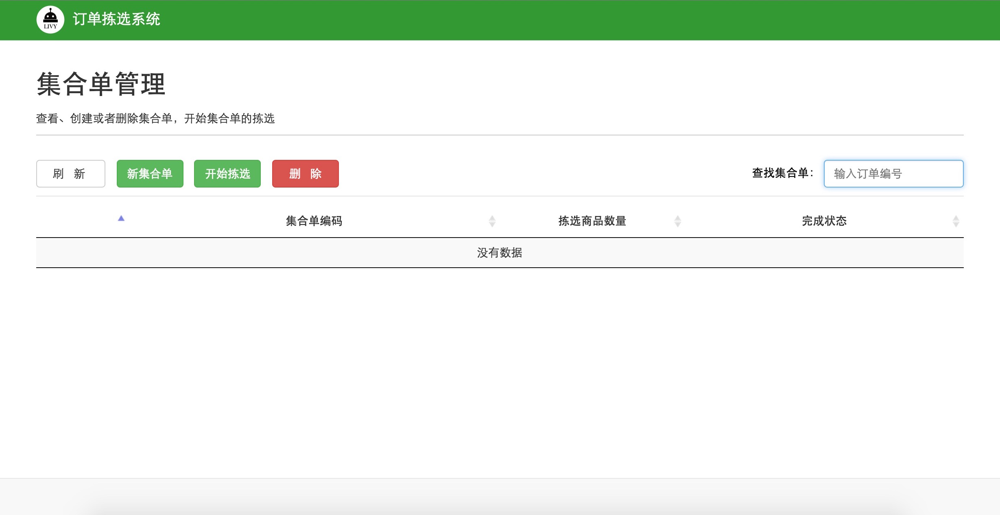
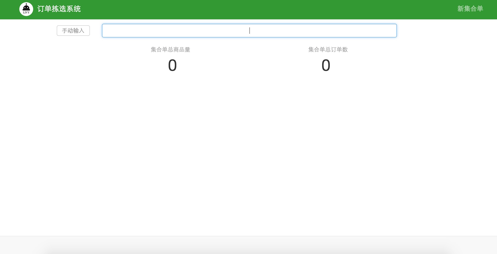
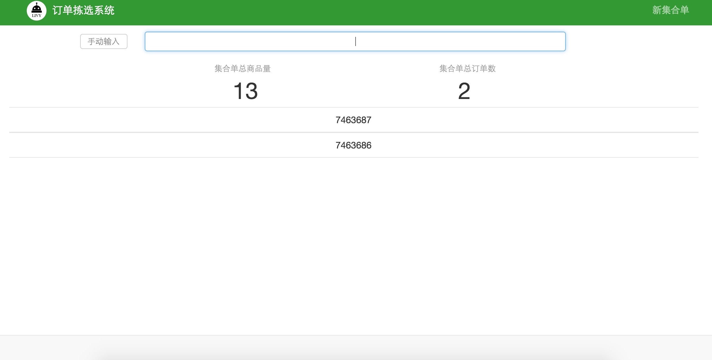
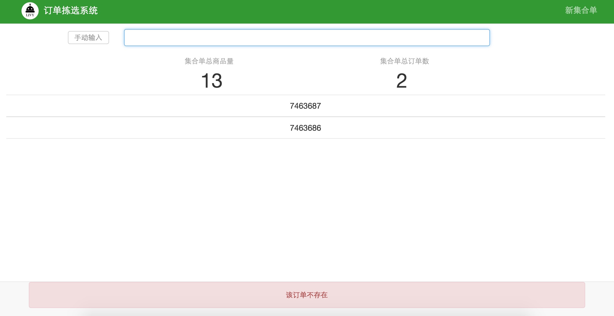
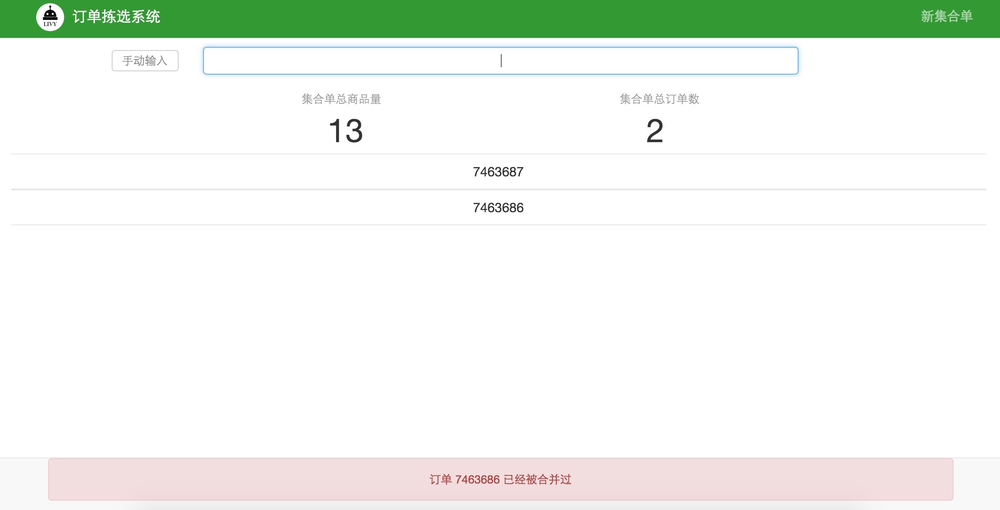

#3.7  新建集合单
集合单合并数量原则：订单导入成功后，由于去冻库拣货使用购物车为容器和运输工具，购物车容量有限，为了提高购物车的装载率，需要合并若干订单来确保每次都能装满购物车。

集合单合并：在系统首页点击集合单管理按钮，如图3-9所示，`合并订单数量的原则是几个订单中商品能够装满整个购物车`。

 
 `图3-9 集合单管理模块` 

点击系统页面新集合单按钮，如图3-10所示，使用条码枪扫描订单条码，鼠标点击输入框，扫描条码，如图2-10所示。

 
 `图3-10 扫描订单集合` 

扫描订单，若干个合并成一个集合单，系统界面会出现集合单中订单数和集合单总商品量，如图3-11所示

 
 `图3-11 生成集合单` 

订单不存在：如果扫描的订单不在导入的订单中，则会在系统页面下边显示“该订单不存在”，如图3-12所示

 
 `图3-12 扫描订单不存在` 

订单重复扫描：如果重复扫描同一个订单，则会在系统页面下边显示“订单XXX已经被合并过”，如图3-13所示

 
 `图3-13 重复扫描同一个订单` 
