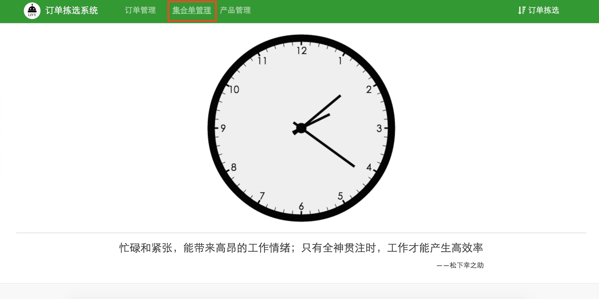

#第2章 订单拣选系统操作说明

##2.1 订单管理
##2.2 集合单管理
##2.3 产品管理
##2.4 订单拣选

###订单拣选系统是以实现订单职能分配为目的而设计的一款系统软件，具体操作分为四部分：订单管理、集合单管理、产品管理和订单拣选。系统界面如图2-1所示

`图2-1`

###2.1 订单管理
>使用订单拣选系统之前，需要导入该时间段所产生的配送单，如图2-2所示

`图2-2`

>在图2-2系统界面单击添加，添加订单，选择文件打开，如图2-3所示

`图2-3`

>订单导入成功，如图2-4所示

`图2-4`

###2.2 集合单管理
>订单导入成功后，点击集合单管理按钮，合并订单

>点击新集合单按钮，扫描订单条码

