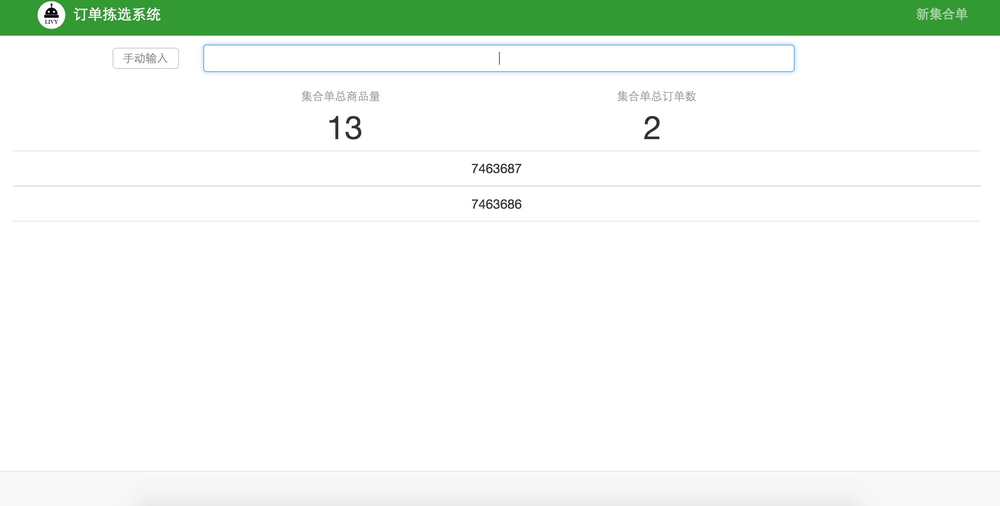
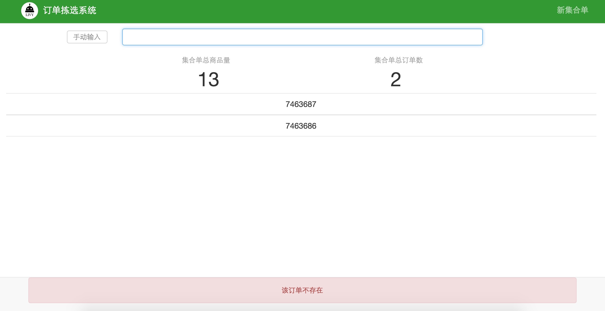

#第2章 订单拣选系统操作说明

##2.1 订单管理
##2.2 集合单管理
##2.3 产品管理
##2.4 订单拣选

###订单拣选系统是以实现订单职能分配为目的而设计的一款系统软件，具体操作分为四部分：订单管理、集合单管理、产品管理和订单拣选。系统界面如图2-1所示

`图2-1`

###2.1 订单管理
>使用订单拣选系统之前，需要导入该时间段所产生的配送单，如图2-2所示

`图2-2`

>在图2-2系统界面单击添加，添加订单，选择文件打开，如图2-3所示

`图2-3`

>订单导入成功，如图2-4所示

`图2-4`

###2.2 集合单管理
>订单导入成功后，由于去冻库拣货使用购物车为容器和运输工具，购物车容量有限，为了提高购物车的装载率，需要合并若干订单来确保每次都能装满购物车，点击集合单管理按钮，如图2-5所示，`合并订单数量的原则是几个订单中商品正好充满整个购物车`。

`图2-5`

>点击系统页面新集合单按钮，如图2-6所示，使用条码枪扫描订单条码，鼠标点击输入框，扫描条码，如图2-6所示

`图2-6`

>扫描订单，若干个合并成一个集合单，系统界面会出现集合单宗订单数和集合单总商品量，如图2-7所示

`图2-7`

>如果扫描的订单不在导入的订单中，则会在系统页面下边显示“该订单不存在”，如图2-8所示

`图2-8`

>如果重复扫描同一个订单，则会在系统页面下边显示“订单XXX已经被合并过”，如图2-9所示

`图2-9`

>新集合单创建完成后，返回集合单管理首页，单击刷新按钮，就会出现合并成功的集合单，如图2-10所示，如集合单合并有误或需要修改集合单，单击某个集合单，单击删除按钮，删除此集合单。

`图2-10`

>根据以上生成集合单，开始在冻库拣选商品，在集合单管理首页，鼠标点击查找集合单的输入框，用条码枪扫描订单，此时会在集合单管理页面显示此订单所在的集合单，如图2-11所示

`图2-11`

>鼠标点击此集合单，然后点击此页面的开始拣选按钮，就会在系统页面中出现此集合单中所有商品信息与数量，如图2-12所示，根据页面显示，拣选商品。

`图2-12`

>此集合单拣选完成后，点击页面右上角完成按钮，如图2-13所示

`图2-13`

>返回集合单管理首页，点击刷新按钮，可以查看拣选完成状态，如图2-14所示，已拣选完成的集合单显示为`已完成`，反之，则是`未完成`。

`图2-14`

>点击开始拣选，继续拣选未完成的集合单，等所有集合单都完成后，返回集合单管理首页，点击刷新，如图2-15所示。

`图2-15`

###2.3 产品管理

###2.4 订单拣选
>从冻库拣选完商品，送到发货区进行二次拣选，打包发货。每个购物车上都有若干订单组成的一个集合单，给每个订单分配一个货位，扫描订单条码，系统自动分配货位，如图2-16所示，直到货位分配满为止。

`图2-16`

>货位全分配完后，系统会在页面提示`货位已满`，如图2-17所示

`图2-17`

